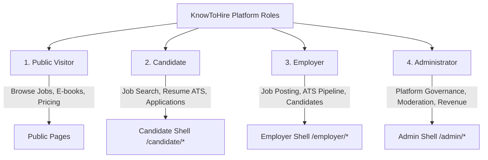
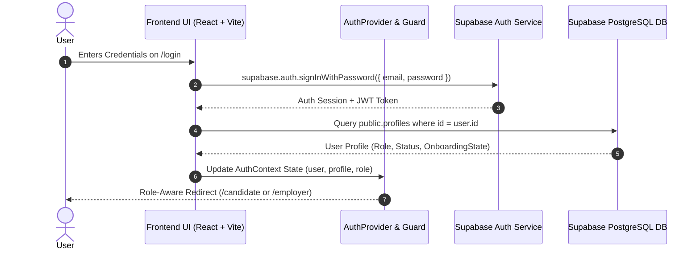
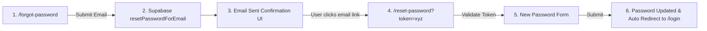
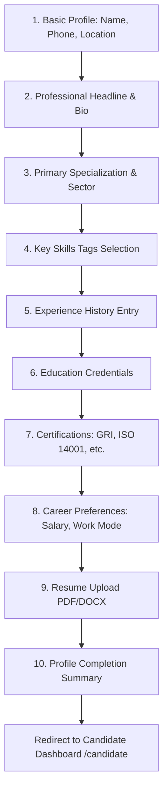
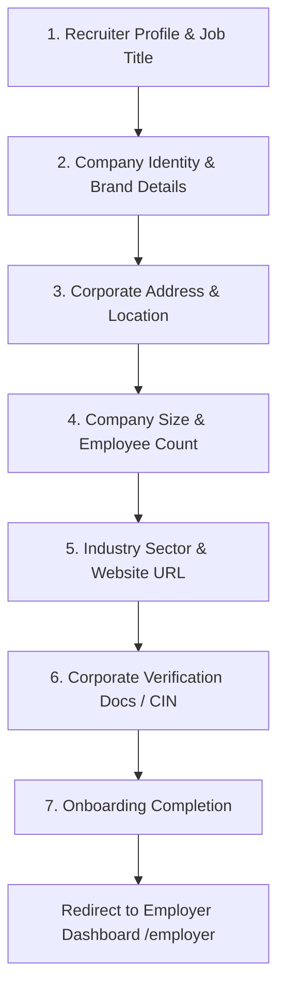
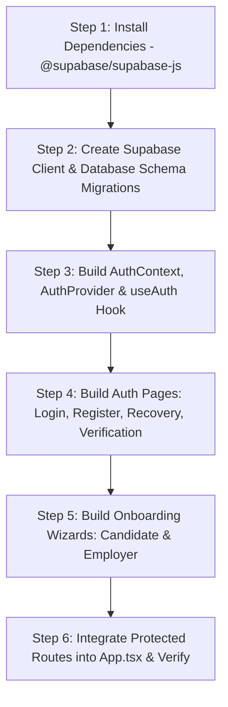

# KNOWTOHIRE — MODULE 01: AUTHENTICATION & ONBOARDING
## Master Architecture & Implementation Plan Specification

---

## 1. Executive Summary

KnowToHire is a unified Career, Hiring, Knowledge, and Professional Resources platform designed specifically for sustainability, ESG, clean tech, environmental compliance, and specialized consulting sectors in India.

The user interface (UI) has been constructed first, establishing a high-craft, professional design system ("Professional Intelligence") featuring a primary SaaS Indigo (`#4F46E5`), Growth Emerald (`#10B981`), and Intelligence Cyan (`#06B6D4`) visual language.

This document presents the complete architectural audit and implementation plan for **Module 01 — Authentication & Onboarding**. It defines how user identity, role-based authorization, security, Supabase Auth integration, data modeling, and onboarding user experiences will be implemented without modifying existing UI aesthetics or breaking existing routes.

> [!IMPORTANT]
> **Module 01 Tasks 01, 02, 03 & 04 Status:** Implemented.
> - **Task 01 (Database & Auth Client):** `@supabase/supabase-js` installed, `.env.example` created, `src/lib/supabase.ts` client initialized, TypeScript entity types created (`src/types/database.ts`), PostgreSQL migration (`20260813000000_auth_and_profiles_schema.sql`) created with complete tables, triggers, and RLS policies.
> - **Task 02 (Auth State & Route Guards):** `src/types/auth.ts`, `AuthProvider` & `useAuth()` hook (`src/context/AuthContext.tsx`), `ProtectedRoute` (`src/components/auth/ProtectedRoute.tsx`), `RoleGuard` (`src/components/auth/RoleGuard.tsx`), `GuestRoute` (`src/components/auth/GuestRoute.tsx`), `main.tsx` provider wrapping, `Navbar` auth integration, and `App.tsx` guarded route classification implemented.
> - **Task 03 (Authentication UI Screens):** Reusable `AuthLayout` (`src/components/auth/AuthLayout.tsx`), `LoginPage` (`src/pages/auth/LoginPage.tsx`), `RegisterPage` (`src/pages/auth/RegisterPage.tsx` with Candidate vs Employer role tabs), `VerifyEmailPage` (`src/pages/auth/VerifyEmailPage.tsx` with 60s cooldown timer), `ForgotPasswordPage` (`src/pages/auth/ForgotPasswordPage.tsx`), and `ResetPasswordPage` (`src/pages/auth/ResetPasswordPage.tsx`) implemented and connected to `AuthContext`.
> - **Task 04 (Candidate & Employer Onboarding Wizards):** Modular onboarding shell (`OnboardingLayout`, `OnboardingProgress`, `OnboardingStepHeader`, `OnboardingNavigation`, `CandidateOnboardingProgress`, `EmployerOnboardingProgress`, `OnboardingComplete`), 10-step candidate wizard (`CandidateOnboardingPage.tsx`), 7-step employer wizard (`EmployerOnboardingPage.tsx`), deterministic candidate completion scoring (`calculateCandidateCompletionPct`), resume validation service (`resumeService.ts`), and Supabase persistence mapping implemented.


---

## 2. Current Repository Audit

A comprehensive inspection of the KnowToHire codebase was conducted. Below are the key findings:

| Category | Item | Findings & Empirical Evidence |
| :--- | :--- | :--- |
| **Dependencies** | `package.json` | React `18.3.1`, TypeScript `5.4.5`, Vite `5.2.13`, Tailwind CSS `3.4.4`, Lucide React `0.395.0`, `react-router-dom` `6.23.1`, `clsx`, `tailwind-merge`. **No Supabase SDK (`@supabase/supabase-js`) or Clerk SDK present.** |
| **Routing** | `src/App.tsx` | Uses custom `window.location.pathname` state (`currentPath`) with `popstate` listeners and a `renderRouteContent()` resolver. Contains a top Quick Switcher Bar for visual route inspection. `react-router-dom` is installed in `package.json` but not used in `App.tsx`. |
| **Public UI** | `src/pages/public/` | 15 completed pages (Home, Jobs, JobDetails, Careers, Knowledge, ResourceDetails, Templates, TemplateDetails, Blog, BlogDetails, Pricing, About, Contact, Privacy, Terms). |
| **Candidate UI** | `src/pages/candidate/` | 11 completed pages (Dashboard, Profile, Resume, Jobs, JobDetails, SavedJobs, Applications, ApplicationDetails, CareerInsights, Notifications, Settings). |
| **Employer UI** | `src/pages/employer/` | 16 completed pages (Dashboard, Jobs, CreateJob, JobDetails, EditJob, JobApplicants, Candidates, CandidateDetails, CandidateCompare, Pipeline, Interviews, SavedCandidates, Analytics, CompanyProfile, Notifications, Settings). |
| **Admin UI** | Platform | No `AdminShell` or `src/pages/admin/` folder exists. `Sidebar.tsx` defines an `adminNav` array (`Governance Health`, `User Operations`, `Content Audit`, `Revenue & GMV`), but no routes or pages exist yet. |
| **UI Components** | `src/components/ui/` | 15 reusable primitives (`Button`, `Input`, `Select`, `Card`, `Badge`, `Alert`, `Dialog`, `Drawer`, `Progress`, `Table`, `Tabs`, `Switch`, `Checkbox`, `Skeleton`, `CommandPalette`). |
| **Mock Data** | `src/data/` | `mockData.ts`, `candidateMockData.ts`, `employerMockData.ts`. Hardcoded user profiles (`MOCK_CANDIDATE_PROFILE`: Aarav Mehta, `MOCK_EMPLOYER`: Priya Nair, `MOCK_COMPANY`: Acme Sustainability). |
| **Auth Search** | Codebase | Searching for `auth`, `login`, `signin`, `supabase`, `clerk` yielded zero authentication context or state. `auth` matched only "Author" in blog/resource metadata. |

---

## 3. Existing Authentication State

- **Current Auth Mechanism:** 100% Mocked / Non-existent.
- **Header Action:** `Navbar.tsx` renders a "Sign In" button configured with `onClick={() => navigateTo('/candidate')}` in `App.tsx`.
- **Portal Entry:** Candidate and Employer shells render mock data directly without session checks or authentication guards.
- **State Persistence:** No `localStorage`, `sessionStorage`, cookies, or tokens are currently stored or evaluated.
- **Route Guards:** Zero protected route wrappers or role checks exist in the current application pipeline.

---

## 4. Role Architecture

The platform recognizes **4 distinct user roles**:



### Existing Code Representations
1. **TypeScript Definitions:** `SidebarProps` in `src/components/navigation/Sidebar.tsx` defines `portalType: 'candidate' | 'employer' | 'admin'`.
2. **Mock Data Boundaries:** Candidate mock data (`candidateMockData.ts`) and Employer mock data (`employerMockData.ts`) are decoupled.

### Planned Role Definition Architecture (Required)
A canonical TypeScript enum will be introduced in `src/types/auth.ts`:

```typescript
export enum UserRole {
  PUBLIC = 'public',
  CANDIDATE = 'candidate',
  EMPLOYER = 'employer',
  ADMIN = 'admin',
}

export enum AccountStatus {
  UNVERIFIED = 'unverified',
  PENDING_ONBOARDING = 'pending_onboarding',
  ACTIVE = 'active',
  SUSPENDED = 'suspended',
  DISABLED = 'disabled',
}
```

---

## 5. Authentication Architecture

The proposed authentication system will use **Supabase Auth** as the primary identity provider, integrated with React frontend state via a unified `AuthContext` and custom hooks.



---

## 6. Registration Flows

### A. Candidate Registration
- **Route:** `/register?role=candidate` (or tab switcher)
- **Form Fields:**
  - Full Name (`Input`)
  - Personal Email (`Input type="email"`)
  - Password (`Input type="password"`, min 8 chars, 1 number, 1 special char)
  - Confirm Password (`Input type="password"`)
  - Terms & Privacy Agreement (`Checkbox`)
- **Action:**
  1. Calls `supabase.auth.signUp({ email, password, data: { full_name, role: 'candidate' } })`.
  2. Inserts row into `public.profiles` with `role = 'candidate'`, `status = 'unverified'`.
  3. Displays success screen prompting user to verify email.

### B. Employer Registration
- **Route:** `/register?role=employer`
- **Form Fields:**
  - Recruiter Full Name (`Input`)
  - Corporate Work Email (`Input type="email"`, validates non-generic domain e.g. excludes `@gmail.com`, `@yahoo.com` where enforced)
  - Password & Confirm Password (`Input`)
  - Company Legal Name (`Input`)
  - Company Industry (`Select`)
  - Terms & B2B Service Agreement (`Checkbox`)
- **Action:**
  1. Calls `supabase.auth.signUp({ email, password, data: { full_name, role: 'employer', company_name } })`.
  2. Inserts row into `public.profiles` with `role = 'employer'`, `status = 'unverified'`.
  3. Displays verification instructions.

### C. Administrator Account Provisioning
- **Public Registration:** strictly disabled.
- **Provisioning:** Admin accounts must be created via Supabase Dashboard, secure CLI scripts, or an internal admin invite endpoint with service-role key authorization.

---

## 7. Login Flow

- **Route:** `/login`
- **Inputs:** Email, Password, "Remember Me" preference.
- **Resolution & Routing Matrix:**

| Role | Account Status | Destination Route |
| :--- | :--- | :--- |
| **Candidate** | `unverified` | `/verify-email` |
| **Candidate** | `pending_onboarding` | `/onboarding/candidate` |
| **Candidate** | `active` | `/candidate` |
| **Employer** | `unverified` | `/verify-email` |
| **Employer** | `pending_onboarding` | `/onboarding/employer` |
| **Employer** | `active` | `/employer` |
| **Admin** | `active` | `/admin` |
| **Any** | `suspended` / `disabled` | `/login` with Error Alert ("Account suspended. Contact support.") |

---

## 8. Password Recovery Flow



- **Expired/Invalid Link:** Renders `Alert` component with error: *"Password reset link has expired or is invalid. Please request a new link."*

---

## 9. Email Verification Flow

- **Behavior:**
  - Upon registration, user receives a verification email containing a secure link.
  - If unverified user attempts to log in or access protected routes, they are redirected to `/verify-email`.
  - `/verify-email` UI includes a **"Resend Verification Email"** button with a 60-second cooldown timer.
- **Restrictions on Unverified Accounts:** Cannot view candidate applications, post jobs, download e-books, or access ATS candidate pipelines.

---

## 10. OAuth Readiness (Google OAuth)

- **Audit Conclusion:** Google OAuth is highly desirable for Candidate single-click signup, but requires Supabase Auth OAuth provider setup and Google Cloud Console OAuth 2.0 Credentials.
- **Planned Status:** **Planned Option (Phase 2)**.
- **Architecture Preparation:**
  - PKCE Auth Callback Route: `/auth/callback`
  - OAuth login trigger: `supabase.auth.signInWithOAuth({ provider: 'google', redirectTo: `${window.location.origin}/auth/callback` })`.

---

## 11. Candidate Onboarding Flow

When a candidate registers and verifies email, they enter the **10-Step Candidate Onboarding Wizard** (`/onboarding/candidate`):



---

## 12. Employer Onboarding Flow

When an employer registers and verifies email, they enter the **7-Step Employer Onboarding Wizard** (`/onboarding/employer`):



---

## 13. Admin Access Control

- **No Public Onboarding:** Admin access cannot be self-served.
- **Session Security:** Admin routes (`/admin/*`) enforce Multi-Factor Authentication (MFA) or secret session verification.
- **Super-Admin Protection:** Admin role assignment requires direct database update or secure service role API call.

---

## 14. Route Architecture

### Proposed Auth & Onboarding Routes

| Route | Purpose | Access Level | UI Components Required |
| :--- | :--- | :--- | :--- |
| `/login` | Email/Password login | Public (Guest only) | `Card`, `Input`, `Button`, `Alert`, `Checkbox` |
| `/register` | Candidate & Employer registration | Public (Guest only) | `Card`, `Tabs`, `Input`, `Button`, `Alert`, `Checkbox` |
| `/forgot-password` | Request password reset email | Public | `Card`, `Input`, `Button`, `Alert` |
| `/reset-password` | Reset password via token link | Token-Guarded Public | `Card`, `Input`, `Button`, `Alert` |
| `/verify-email` | Email verification prompt | Authenticated Unverified | `Card`, `Button`, `Alert`, Cooldown Timer |
| `/onboarding/candidate` | Candidate profile wizard | Candidate (Uncompleted) | Stepper, `Input`, `Select`, `Badge`, `Progress`, `Button` |
| `/onboarding/employer` | Employer & Company wizard | Employer (Uncompleted) | Stepper, `Input`, `Select`, `Card`, `Progress`, `Button` |
| `/auth/callback` | OAuth PKCE code handler | Public | Loading Skeleton / Spinner |
| `/logout` | Clears auth session | Authenticated | None (Immediate redirect to `/`) |

### Protected Route Groups

```
PUBLIC ROUTES (Unprotected):
├── /
├── /jobs
├── /jobs/:id
├── /careers
├── /knowledge
├── /knowledge/:id
├── /templates
├── /templates/:id
├── /blog
├── /blog/:slug
├── /pricing
├── /about
├── /contact
├── /privacy
└── /terms

AUTH ROUTES (Guest Only):
├── /login
├── /register
├── /forgot-password
└── /reset-password

CANDIDATE PROTECTED ROUTES (Role: Candidate + Verified + Onboarded):
└── /candidate/*

EMPLOYER PROTECTED ROUTES (Role: Employer + Verified + Onboarded):
└── /employer/*

ADMIN PROTECTED ROUTES (Role: Admin + MFA):
└── /admin/*
```

---

## 15. Auth State Architecture

A central `AuthContext` will manage identity across the application tree:

```typescript
// Proposed Interface: src/context/AuthContext.tsx
export interface AuthState {
  user: User | null;                // Supabase Auth User
  profile: UserProfile | null;      // Database Profile Record
  role: UserRole;                   // Active Role
  status: AccountStatus;            // Account Status
  isAuthenticated: boolean;
  isLoading: boolean;
  error: string | null;
}
```

### Component Hierarchy Flow:

```
App
 └── AuthProvider (Initializes Supabase listener onAuthStateChange)
      └── Router / Path Resolver
           ├── GuestRoute Guard (Redirects authenticated users away from /login)
           └── ProtectedRoute Guard (Verifies Auth + Role + Status)
                ├── RoleGuard (role="candidate") ──> CandidateShell
                ├── RoleGuard (role="employer")  ──> EmployerShell
                └── RoleGuard (role="admin")     ──> AdminShell
```

---

## 16. User / Profile Data Model

Conceptual relational entity diagram for Supabase PostgreSQL database:

```mermaid
erDiagram
    auth_users ||--|| profiles : "has identity"
    profiles ||--o| candidate_profiles : "extends if Candidate"
    profiles ||--o| employer_profiles : "extends if Employer"
    company_profiles ||--|{ employer_profiles : "belongs to company"

    auth_users {
        uuid id PK
        string email
        timestamp created_at
    }

    profiles {
        uuid id PK_FK
        string email
        string full_name
        string role "candidate | employer | admin"
        string status "unverified | pending_onboarding | active | disabled"
        timestamp created_at
        timestamp updated_at
    }

    candidate_profiles {
        uuid id PK
        uuid user_id FK
        string headline
        string phone
        string location
        text bio
        integer profile_strength
        jsonb experience
        jsonb education
        jsonb skills
        jsonb certifications
        string resume_url
        boolean onboarding_completed
    }

    company_profiles {
        uuid id PK
        string name
        string industry
        string size
        string website
        string location
        string logo_url
        string verification_status
    }

    employer_profiles {
        uuid id PK
        uuid user_id FK
        uuid company_id FK
        string title
        string phone
        boolean onboarding_completed
    }
```

---

## 17. Security Architecture

### Client-Side UX Protection vs. Server-Side Security

> [!CAUTION]
> **Client-Side Guards Are UX Only:** Frontend route guards (`ProtectedRoute`, `RoleGuard`) strictly prevent unauthorized screen rendering for user convenience. They do NOT secure data.
> **Database RLS Is Mandatory:** Real security MUST be enforced at the Supabase PostgreSQL layer using Row Level Security (RLS) policies.

### Security Checklist:
1. **Row Level Security (RLS):**
   - Candidate data (`candidate_profiles`, applications) restricted to row owner (`auth.uid() = user_id`) or authorized employer during active job application.
   - Employer ATS data (`company_profiles`, jobs, applicants) restricted to verified company members.
2. **Role Escalation Prevention:** `role` field in `public.profiles` cannot be modified by regular users via API. Modifiable only via secure database triggers or admin functions.
3. **Session Validation:** Auto-refresh JWT tokens; handle expired session gracefully with toast notification and redirect to `/login`.
4. **Password Policy:** Minimum 8 characters, uppercase, lowercase, number, and special character required.

---

## 18. UX States Matrix

Every authentication and onboarding interface must explicitly handle all 8 core UX states:

| Screen | Initial | Typing | Submitting | Success | Error / Invalid | Special State |
| :--- | :--- | :--- | :--- | :--- | :--- | :--- |
| **Login** | Clean inputs | Active focus ring | `isLoading=true` button spinner | Redirect to portal | Red error `Alert` ("Invalid email or password") | Account disabled / Unverified notice |
| **Registration** | Role selected | Client validation | Submitting payload | Show "Check Email" state | Duplicate email warning | Non-corporate email notice for Employers |
| **Forgot Password**| Email input | Validating email | Sending reset link | "Reset Link Sent" confirmation card | Rate limit / Invalid email error | Cooldown timer (60s) |
| **Onboarding** | Step 1 active | Form input | Saving step progress | Advance to next step | Field validation errors | Session expired modal |

---

## 19. UI Requirements

Authentication and onboarding interfaces must strictly utilize the existing **KnowToHire Design System**:

- **Color Tokens:**
  - Primary Action: SaaS Indigo `#4F46E5` (`COLORS.primary[600]`)
  - Growth Accent: Emerald `#10B981` (`COLORS.emerald[500]`)
  - Intelligence Accent: Cyan `#06B6D4` (`COLORS.cyan[500]`)
  - Neutrals: Slate `#0F172A` to `#F8FAFC`
- **Typography:** Plus Jakarta Sans (Headings), Inter (Body), JetBrains Mono (Data/Badges).
- **Reusable Primitives:** Must use existing `Button.tsx`, `Input.tsx`, `Select.tsx`, `Card.tsx`, `Badge.tsx`, `Alert.tsx`, `Progress.tsx`, `Tabs.tsx`.

---

## 20. Responsive Requirements

- **Desktop (1280px+):** Centered split-screen authentication cards with branded left hero banner ("Knowledge → Opportunity → Growth").
- **Tablet (768px - 1279px):** Centered card layout with top brand mark.
- **Mobile (375px - 767px):** Full-width card with minimum 44px touch targets for all buttons and form controls. No horizontal scrollbars.

---

## 21. Accessibility Requirements (WCAG 2.2 AA)

- All form controls explicitly linked via `htmlFor` and `id` attributes (implemented in `Input.tsx`).
- Error messages announced with `role="alert"` and `aria-live="polite"`.
- Visible focus rings (`focus:ring-2 focus:ring-kth-primary-600`).
- Keyboard navigable form controls (Tab, Shift+Tab, Enter, Space).
- Non-color-dependent status indicators (combining icons + text badges).

---

## 22. Existing UI Integration Points

1. **`Navbar.tsx` (Public Header):**
   - Unauthenticated: Renders "Sign In" (`/login`) and "+ Post a Job" (`/register?role=employer`).
   - Authenticated: Renders user profile pill with avatar and dropdown menu ("My Dashboard", "Settings", "Sign Out").
2. **`CandidateSidebar.tsx` & `EmployerSidebar.tsx`:**
   - Wire "Sign Out" button (`LogOut` icon) to execute `auth.signOut()` and navigate to `/`.
3. **`App.tsx` (Route Resolver):**
   - Integrate `AuthProvider` and replace direct mock rendering with `ProtectedRoute` wrappers.

---

## 23. Implementation Sequence

The execution of Module 01 will follow this strict 6-step sequence:



---

## 24. Testing Strategy

1. **Unit & Hook Testing:** Test `AuthContext` state transitions (login, signup, logout, session expiration).
2. **Form Validation Testing:** Test empty fields, invalid emails, weak passwords, password mismatch.
3. **Route Guard Testing:** Verify unauthenticated users cannot access `/candidate` or `/employer` routes.
4. **Role Isolation Testing:** Verify Candidate cannot access `/employer` routes and vice versa.
5. **Responsive & Accessibility Testing:** Verify keyboard tab navigation and mobile screen compliance.

---

## 25. Risks & Open Questions

| Risk / Open Question | Impact | Mitigation Strategy |
| :--- | :--- | :--- |
| **Vite Custom Routing vs React Router** | Current `App.tsx` uses custom `window.location.pathname` state matching instead of `BrowserRouter`. | `App.tsx` can be cleanly enhanced to handle new auth paths using the existing `navigateTo` pattern, or migrated to `react-router-dom` `Routes` if requested. |
| **Supabase Project Credentials** | Requires `VITE_SUPABASE_URL` and `VITE_SUPABASE_ANON_KEY`. | Environment variables will be configured in `.env.local` during Phase 2 implementation. |
| **Corporate Email Verification** | Strict domain checking could block valid early-stage startup recruiters using generic emails. | Provide warning badge instead of hard block during initial employer signup. |

---

## 26. Definition of Done (Module 01)

- [x] Complete `docs/authentication_onboarding_plan.md` created and approved by user.
- [x] Supabase Auth SDK installed and database schema deployed.
- [x] `AuthContext` and `ProtectedRoute` implemented.
- [x] `/login`, `/register`, `/forgot-password`, `/reset-password`, `/verify-email` pages live and functional.
- [x] Candidate & Employer onboarding wizards operational (`/onboarding/candidate` & `/onboarding/employer`).
- [ ] Navbar and Sidebars updated to display real session state and handle logout.
- [ ] Full end-to-end user verification completed across Desktop, Tablet, and Mobile.
