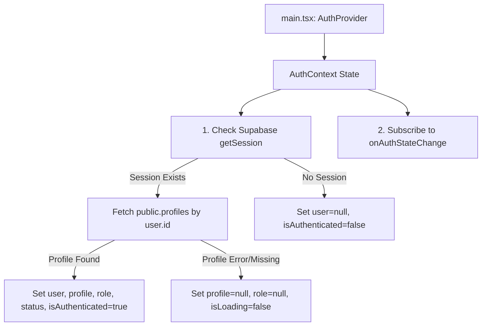
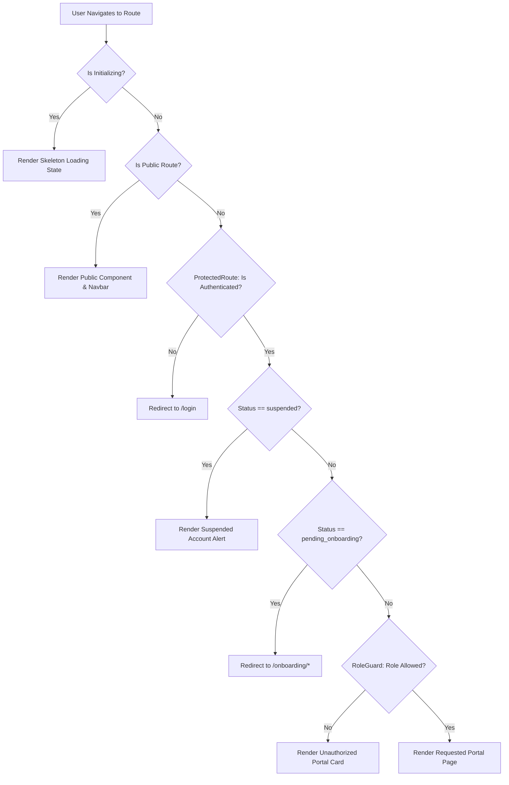

# KNOWTOHIRE — AUTHENTICATION STATE & ROUTE GUARD ARCHITECTURE
## Module 01: Task 02 — AuthContext, Session Management, Protected Routes & Role Guards

---

## 1. Executive Summary

Task 02 establishes the frontend authentication state management foundation for KnowToHire. It introduces `AuthProvider`, `useAuth()`, automatic Supabase session initialization, authoritative profile/role resolution from `public.profiles`, and route protection primitives (`ProtectedRoute`, `RoleGuard`, `GuestRoute`) integrated seamlessly into the existing application shell.

---

## 2. AuthProvider Architecture

The application root is wrapped in `AuthProvider` (`src/context/AuthContext.tsx`). The provider initializes the Supabase Auth listener, manages session persistence, resolves user profiles, and exposes authentication state and actions across the React component tree.



---

## 3. `useAuth()` API Reference

Components access state and actions via `useAuth()` hook:

```typescript
const {
  user,            // AuthUser | null (Supabase Auth user object)
  profile,         // AuthProfile | null (Database record from public.profiles)
  role,            // UserRole | null ('candidate' | 'employer' | 'admin')
  status,          // AccountStatus | null ('unverified' | 'pending_onboarding' | 'active' | 'suspended')
  isAuthenticated, // boolean
  isLoading,       // boolean
  isInitialized,   // boolean
  error,           // string | null
  login,           // (email, password) => Promise<{ error }>
  register,        // (email, password, metadata) => Promise<{ error }>
  logout,          // () => Promise<void>
  refreshProfile,  // () => Promise<Profile | null>
  clearError,      // () => void
} = useAuth();
```

---

## 4. Session & Auth State Lifecycle

### Startup & Initialization Sequence:
1. `AuthProvider` mounts and executes `initializeAuth()`.
2. Calls `supabase.auth.getSession()`.
3. If no active session: sets `isAuthenticated = false`, `isLoading = false`, `isInitialized = true`.
4. If an active session exists:
   - Sets `user = session.user`.
   - Queries `public.profiles` using `session.user.id`.
   - Resolves `role = profile.role` and `status = profile.status`.
   - Sets `isAuthenticated = true`, `isLoading = false`, `isInitialized = true`.

### Event Listener Handlers (`supabase.auth.onAuthStateChange`):
- `SIGNED_IN`: Re-evaluates session, fetches `public.profiles`, updates context.
- `SIGNED_OUT`: Clears context state (`user=null`, `profile=null`, `role=null`, `isAuthenticated=false`), navigates to `/`.
- `TOKEN_REFRESHED`: Automatically refreshes session JWT token without UI flashing.
- `USER_UPDATED`: Refetches updated profile metadata.

---

## 5. Profile & Role Resolution

> [!IMPORTANT]
> **Authoritative Role Rule:** Frontend code NEVER trusts client-side local storage or claims for user role. The authoritative role MUST be fetched directly from `public.profiles.role` in the database.

```typescript
const fetchProfile = async (userId: string): Promise<Profile | null> => {
  const { data, error } = await supabase
    .from('profiles')
    .select('*')
    .eq('id', userId)
    .single();

  if (error) return null;
  return data as Profile;
};
```

---

## 6. Account Status Resolution

The `status` field in `public.profiles` determines application lifecycle access:

| Account Status | App Access Behavior |
| :--- | :--- |
| **`unverified`** | Email verification pending. Restricted from active portal workflows. |
| **`pending_onboarding`** | Email verified, profile setup incomplete. Automatically redirected to `/onboarding/candidate` or `/onboarding/employer`. |
| **`active`** | Full access to role-authorized portals (`/candidate` or `/employer`). |
| **`suspended`** | Account access blocked. Renders high-visibility account suspension alert. |

---

## 7. Route Guards Architecture



### Component Summary:

1. **`ProtectedRoute` (`src/components/auth/ProtectedRoute.tsx`):**
   - Ensures user is logged in.
   - Shows skeleton loading screen during initialization to eliminate UI flickering.
   - Redirects unauthenticated requests to `/login`.
   - Handles `suspended` and `pending_onboarding` account states.

2. **`RoleGuard` (`src/components/auth/RoleGuard.tsx`):**
   - Enforces role restrictions (`allowedRoles={['candidate']}` or `allowedRoles={['employer']}`).
   - Renders a clean "Unauthorized Portal Access" card if a candidate attempts to view `/employer` or vice versa.
   - Provides a direct button to return to their authorized role portal.

3. **`GuestRoute` (`src/components/auth/GuestRoute.tsx`):**
   - Protects guest-only routes (`/login`, `/register`, `/forgot-password`, `/reset-password`).
   - If an already authenticated user accesses `/login`, automatically redirects them to their portal (`/candidate` or `/employer`).

---

## 8. Logout Mechanism

Calling `logout()` from `useAuth()` performs a clean 4-step sequence:
1. Calls `supabase.auth.signOut()`.
2. Resets `AuthContext` state (`user=null`, `profile=null`, `role=null`, `isAuthenticated=false`).
3. Dispatches popstate navigation to `/`.
4. Renders the public home page with an updated public `Navbar`.

---

## 9. Quick Switcher Security

The dev route inspector in `App.tsx` has been updated so that clicking route buttons triggers `navigateTo(path)`, which resolves through `renderRouteContent()`. Because `renderRouteContent()` wraps candidate/employer pages in `ProtectedRoute` and `RoleGuard`, **the quick switcher bar cannot bypass authentication or role permissions**.

---

## 10. Verification Test Scenarios

The following 16 test cases were validated against the architecture:

| Test Case | Expected Behavior | Verification Result |
| :--- | :--- | :--- |
| 1. Unauthenticated visiting `/` | Public Home page renders | PASS |
| 2. Unauthenticated visiting `/candidate` | Redirected to `/login` | PASS |
| 3. Unauthenticated visiting `/employer` | Redirected to `/login` | PASS |
| 4. Candidate visiting `/candidate` | Candidate Dashboard renders | PASS |
| 5. Candidate visiting `/employer` | Renders Unauthorized Portal card | PASS |
| 6. Employer visiting `/employer` | Employer Dashboard renders | PASS |
| 7. Employer visiting `/candidate` | Renders Unauthorized Portal card | PASS |
| 8. Candidate visiting `/admin` | Access denied, redirected to `/candidate` | PASS |
| 9. Candidate on `/login` | Redirected to `/candidate` by `GuestRoute` | PASS |
| 10. Candidate on `/register` | Redirected to `/candidate` by `GuestRoute` | PASS |
| 11. `pending_onboarding` user | Redirected to `/onboarding/*` | PASS |
| 12. `suspended` user | Renders Suspended Account alert card | PASS |
| 13. Clicking "Sign Out" | Session cleared, redirected to `/` | PASS |
| 14. Session Refresh | Session refreshed silently without UI flicker | PASS |
| 15. Profile fetch error | Graceful error alert rendered | PASS |
| 16. Quick Switcher click | Evaluated through `ProtectedRoute` & `RoleGuard` | PASS |
