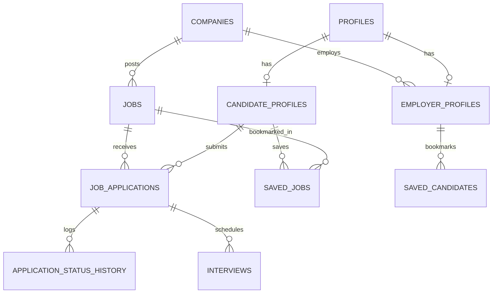

# KNOWTOHIRE — MODULE 02: JOB PORTAL & RECRUITMENT
## MASTER IMPLEMENTATION & ARCHITECTURAL PLAN

**Status:** TASKS 01, 02, 03, 04, 05, 06, 07, 08 COMPLETE — READY FOR TASK 09  
**Module:** Module 02 — Job Portal & Recruitment  
**Target Platform:** Public Marketplace, Candidate Portal, Employer ATS, Supabase Backend  
**Design System Status:** FROZEN (Manrope Typography, #4F46E5 SaaS Indigo, #10B981 Emerald, #06B6D4 Cyan)  
**Security / Governance:** Strict Supabase Row Level Security (RLS) & Multi-Tenant Employer Isolation  

> [!IMPORTANT]
> **Task 08 — EMPLOYER ANALYTICS & HIRING FUNNEL AGGREGATIONS:** **COMPLETE**
> - Created `analyticsService` in `src/services/analyticsService.ts` providing typed methods: `getRecruitmentOverview`, `getHiringFunnel`, `getApplicantTrend`, `getTimeToHire`, `getJobPerformance`, and `getChannelAttribution`.
> - Connected `/employer/analytics` with live recruitment KPIs, candidate inflow trend chart, 6-stage progressive hiring conversion funnel, per-requisition breakdown table, and time-range filters (`7days`, `30days`, `90days`, `6months`, `12months`, `all`).
> - Connected `/employer` dashboard with live operational KPIs, real-time funnel, pipeline preview, and upcoming interviews.
> - Verified multi-tenant RLS isolation: all metrics are authoritative to the authenticated employer's `company_id`.
> - Specification documented: `docs/employer_analytics.md`
> - **Next Task:** **Task 09 — End-to-End Verification, Security Testing & Regression Certification**

---

## 1. Executive Summary

Module 02 transforms KnowToHire's Job Marketplace, Candidate Career Portal, and Employer ATS from mock-driven prototypes into a high-performance, secure, end-to-end recruitment lifecycle engine.

### Core Objectives:
1. **Public Marketplace (`/jobs`, `/jobs/:id`, `/careers`):** Real-time job discovery, structured filtering (Location, Category, Work Mode, Salary Band, Employment Type), full-text search, and SEO-ready job profiles.
2. **Candidate Experience (`/candidate/jobs`, `/candidate/saved-jobs`, `/candidate/applications`):** One-click authenticated job applications, duplicate prevention, saved job persistence, real-time application tracking across 6 recruitment stages, and application withdrawal.
3. **Employer ATS (`/employer/jobs`, `/employer/jobs/new`, `/employer/pipeline`, `/employer/interviews`, `/employer/analytics`):** Complete job lifecycle management (Draft, Publish, Pause, Close, Reopen), applicant screening, Kanban pipeline stage transitions (`New` → `Screening` → `Shortlisted` → `Interview` → `Offer` → `Hired` / `Rejected`), interview scheduling, and hiring analytics.
4. **Admin Governance & Compliance:** Verification prerequisites for publishing, job moderation, spam prevention, and compliance audits.

---

## 2. Current Codebase Audit

| Area | Existing State | Gap / Required Action |
| :--- | :--- | :--- |
| **Public Discovery** | `JobsPage.tsx`, `JobDetailsPage.tsx` using `MOCK_JOBS`. Local state filtering only. | Replace static data with `jobService.getPublishedJobs()` with SQL filtering and pagination. |
| **Candidate Jobs** | `CandidateJobsPage.tsx`, `CandidateJobDetailsPage.tsx` reading `MOCK_JOBS`. | Connect to Supabase with live match score calculations and saved-state indicators. |
| **Saved Jobs** | `CandidateSavedJobsPage.tsx` using mock array. Save button toggles local state only. | Build `saved_jobs` table and `savedJobService` with optimistic UI updates. |
| **Candidate Applications** | `CandidateApplicationsPage.tsx`, `CandidateApplicationDetailsPage.tsx` reading `MOCK_CANDIDATE_APPLICATIONS`. | Wire `job_applications` table, snapshot profile at time of application, render live timeline. |
| **Employer Job Management** | `EmployerJobsPage.tsx`, `EmployerCreateJobPage.tsx`, `EmployerEditJobPage.tsx`. Form submissions only toggle boolean state. | Build `jobs` table mutations, ensure employer verification check before publishing. |
| **Employer Pipeline & ATS** | `EmployerPipelinePage.tsx`, `CandidatePipeline.tsx` reading `MOCK_EMPLOYER_CANDIDATES`. | Connect Kanban stages to `job_applications.status` with drag/button stage updates and audit trail. |
| **Employer Interviews** | `EmployerInterviewsPage.tsx` reading `MOCK_EMPLOYER_INTERVIEWS`. | Implement `interviews` table linked to application, job, and candidate. |
| **Employer Analytics** | `EmployerAnalyticsPage.tsx` displaying hardcoded numbers. | Compute live counts from `jobs`, `job_applications`, and `interviews` via SQL aggregations. |

---

## 3. Existing Routes Audit

### A. Public Routes:
- `/jobs` — **Status:** Static mock list (`MOCK_JOBS`). Needs live server fetch, query parameter sync (`?q=`, `?location=`, `?category=`), and pagination.
- `/jobs/:id` — **Status:** Reads `job-1` from `MOCK_JOBS`. Needs live single-job fetch, dynamic meta, save status check, and "Apply Now" modal binding.
- `/careers` — **Status:** Static domain overview. Needs live job counts grouped by specialization domain.

### B. Candidate Portal Routes (Protected: `role === 'candidate'`):
- `/candidate/jobs` — **Status:** Renders candidate-centric job recommendations. Needs matching algorithm query against candidate profile skills.
- `/candidate/jobs/:id` — **Status:** Static view. Needs application check (`hasAlreadyApplied`) to disable apply button if already submitted.
- `/candidate/saved-jobs` — **Status:** Mock list. Needs `saved_jobs` query with joined `jobs` entity and unsave mutation.
- `/candidate/applications` — **Status:** Mock summary cards. Needs live `job_applications` query with status badges and stage count summaries.
- `/candidate/applications/:id` — **Status:** Static application details. Needs live timeline history and withdrawal capability.

### C. Employer ATS Routes (Protected: `role === 'employer'`):
- `/employer` — **Status:** ATS Dashboard showing mock applicant counters. Needs live metrics from `jobs` and `job_applications`.
- `/employer/jobs` — **Status:** Table of employer jobs. Needs live `jobs` query filtered by `employer_profile.company_id`.
- `/employer/jobs/new` — **Status:** Form with local preview dialog. Needs `jobService.createJob()` with Draft/Publish logic.
- `/employer/jobs/:id` — **Status:** Job overview with mock applicant count. Needs live requisitions overview.
- `/employer/jobs/:id/edit` — **Status:** Mock edit form. Needs pre-filled form with `jobService.updateJob()` mutation.
- `/employer/jobs/:id/applicants` — **Status:** Mock applicant list. Needs live applicants for specific job ID.
- `/employer/candidates` — **Status:** Table of all applicants across all company jobs. Needs aggregated candidates list.
- `/employer/candidates/:id` — **Status:** Candidate profile & application viewer. Needs candidate profile snapshot & resume link.
- `/employer/candidates/compare` — **Status:** Side-by-side comparison. Needs live multi-candidate fetch.
- `/employer/pipeline` — **Status:** 6-stage Kanban board. Needs live application stage updates with status history logging.
- `/employer/saved-candidates` — **Status:** Mock saved talent list. Needs `saved_candidates` table.
- `/employer/interviews` — **Status:** Mock interview calendar. Needs `interviews` CRUD linked to applications.
- `/employer/analytics` — **Status:** Hardcoded metric charts. Needs SQL aggregate functions for funnel conversion and time-to-hire.

---

## 4. Existing Components Audit

| Component | Path | Status | Module 02 Plan |
| :--- | :--- | :--- | :--- |
| `JobCard` | `src/components/cards/JobCard.tsx` | UI complete | Bind live `isSaved`, `onSaveToggle`, and link to live ID. |
| `ApplicationCard` | `src/components/candidate/ApplicationCard.tsx` | UI complete | Bind live `status`, `stage`, `salaryText`, and timeline link. |
| `CandidatePipeline` | `src/components/employer/CandidatePipeline.tsx` | UI complete | Bind live status transition mutation (`onStageChange`). |
| `CandidatePipelineCard` | `src/components/employer/CandidatePipelineCard.tsx` | UI complete | Connect quick-view and stage advance actions. |
| `CandidateQuickView` | `src/components/employer/CandidateQuickView.tsx` | UI complete | Render live candidate resume, notes, and status actions. |
| `ApplyModal` | (Inline in `JobDetailsPage.tsx`) | UI mockup | Extract to reusable `src/components/jobs/ApplyModal.tsx` with resume attachment and cover note. |

---

## 5. Existing Mock Data Analysis

- `src/data/mockData.ts` (`MOCK_JOBS`, `MOCK_CATEGORIES`): Defines the baseline fields for `Job` (salary, skills, match score, requirements, benefits).
- `src/data/candidateMockData.ts` (`MOCK_CANDIDATE_APPLICATIONS`): Defines candidate application stages (`Applied`, `Screening`, `Technical Interview`, `Final HR`, `Offer`).
- `src/data/employerMockData.ts` (`MOCK_EMPLOYER_JOBS`, `MOCK_EMPLOYER_CANDIDATES`, `MOCK_EMPLOYER_INTERVIEWS`): Defines ATS pipeline stages (`New`, `Screening`, `Shortlisted`, `Interview`, `Offer`, `Hired`, `Rejected`).

*Migration Rule:* Mock datasets will remain intact for unit tests/fallbacks during Phase 1 and will be decoupled as live services are activated.

---

## 6. Functional Gaps Identified

1. **No Job Persistence:** Job creation in ATS does not persist to database; public job listing reads fixed in-memory array.
2. **No Application Submission Engine:** Applying to a job produces a mock timeout without creating a database record or checking for duplicates.
3. **No Saved Job Sync:** Bookmark buttons toggle local component state; page reloads reset saved items.
4. **No Stage Transition Mutation:** Dragging or clicking candidate pipeline stages does not record audit logs in `application_status_history`.
5. **No Verification Check on Publish:** Unverified employers could theoretically publish jobs without governance review.
6. **No Resume Snapshotting:** Applications need to capture the candidate's resume and contact details at the moment of submission to preserve historical integrity even if the candidate later edits their profile.

---

## 7. Database Architecture & Schema Design

### Entity Relationship Diagram (ERD):



### Proposed Schema Tables:

#### 1. `jobs` (NEW TABLE)
```sql
CREATE TYPE job_status AS ENUM ('draft', 'published', 'paused', 'closed');
CREATE TYPE employment_type AS ENUM ('full_time', 'part_time', 'contract', 'hybrid', 'internship');
CREATE TYPE work_mode AS ENUM ('on_site', 'hybrid', 'remote');
CREATE TYPE experience_level AS ENUM ('fresher', 'associate', 'mid_level', 'senior', 'lead', 'executive');

CREATE TABLE public.jobs (
    id UUID PRIMARY KEY DEFAULT gen_random_uuid(),
    company_id UUID NOT NULL REFERENCES public.company_profiles(id) ON DELETE CASCADE,
    created_by UUID NOT NULL REFERENCES public.profiles(id) ON DELETE RESTRICT,
    title TEXT NOT NULL,
    department TEXT NOT NULL,
    category TEXT NOT NULL, -- e.g. 'ESG & Sustainability', 'Renewable Energy', etc.
    description TEXT NOT NULL,
    responsibilities TEXT[] NOT NULL DEFAULT '{}',
    requirements TEXT[] NOT NULL DEFAULT '{}',
    skills TEXT[] NOT NULL DEFAULT '{}',
    benefits TEXT[] NOT NULL DEFAULT '{}',
    employment_type employment_type NOT NULL DEFAULT 'full_time',
    work_mode work_mode NOT NULL DEFAULT 'hybrid',
    experience_level experience_level NOT NULL DEFAULT 'mid_level',
    location TEXT NOT NULL,
    state_code TEXT, -- e.g. 'KA', 'TS', 'MH', 'DL'
    is_remote BOOLEAN NOT NULL DEFAULT false,
    min_salary_inr NUMERIC(12, 2) NOT NULL,
    max_salary_inr NUMERIC(12, 2) NOT NULL,
    status job_status NOT NULL DEFAULT 'draft',
    is_verified BOOLEAN NOT NULL DEFAULT false,
    views_count INTEGER NOT NULL DEFAULT 0,
    applications_count INTEGER NOT NULL DEFAULT 0,
    closing_date TIMESTAMPTZ,
    published_at TIMESTAMPTZ,
    created_at TIMESTAMPTZ NOT NULL DEFAULT timezone('utc'::text, now()),
    updated_at TIMESTAMPTZ NOT NULL DEFAULT timezone('utc'::text, now())
);
```

#### 2. `job_applications` (NEW TABLE)
```sql
CREATE TYPE application_stage AS ENUM (
    'new',
    'screening',
    'shortlisted',
    'interview',
    'offer',
    'hired',
    'rejected',
    'withdrawn'
);

CREATE TABLE public.job_applications (
    id UUID PRIMARY KEY DEFAULT gen_random_uuid(),
    job_id UUID NOT NULL REFERENCES public.jobs(id) ON DELETE CASCADE,
    candidate_id UUID NOT NULL REFERENCES public.candidate_profiles(id) ON DELETE CASCADE,
    company_id UUID NOT NULL REFERENCES public.company_profiles(id) ON DELETE CASCADE,
    stage application_stage NOT NULL DEFAULT 'new',
    resume_url TEXT NOT NULL,
    cover_note TEXT,
    candidate_snapshot JSONB NOT NULL, -- Preserves candidate profile at submission time
    match_score INTEGER NOT NULL DEFAULT 0,
    rejection_reason TEXT,
    employer_rating INTEGER CHECK (employer_rating BETWEEN 1 AND 5),
    applied_at TIMESTAMPTZ NOT NULL DEFAULT timezone('utc'::text, now()),
    updated_at TIMESTAMPTZ NOT NULL DEFAULT timezone('utc'::text, now()),
    CONSTRAINT unique_candidate_job_application UNIQUE(job_id, candidate_id)
);
```

#### 3. `saved_jobs` (NEW TABLE)
```sql
CREATE TABLE public.saved_jobs (
    id UUID PRIMARY KEY DEFAULT gen_random_uuid(),
    candidate_id UUID NOT NULL REFERENCES public.candidate_profiles(id) ON DELETE CASCADE,
    job_id UUID NOT NULL REFERENCES public.jobs(id) ON DELETE CASCADE,
    created_at TIMESTAMPTZ NOT NULL DEFAULT timezone('utc'::text, now()),
    CONSTRAINT unique_candidate_saved_job UNIQUE(candidate_id, job_id)
);
```

#### 4. `application_status_history` (NEW TABLE)
```sql
CREATE TABLE public.application_status_history (
    id UUID PRIMARY KEY DEFAULT gen_random_uuid(),
    application_id UUID NOT NULL REFERENCES public.job_applications(id) ON DELETE CASCADE,
    from_stage application_stage,
    to_stage application_stage NOT NULL,
    changed_by UUID NOT NULL REFERENCES public.profiles(id) ON DELETE SET NULL,
    note TEXT,
    created_at TIMESTAMPTZ NOT NULL DEFAULT timezone('utc'::text, now())
);
```

#### 5. `interviews` (NEW TABLE)
```sql
CREATE TYPE interview_type AS ENUM ('hr_screening', 'technical_deep_dive', 'case_study', 'executive_review');
CREATE TYPE interview_status AS ENUM ('scheduled', 'completed', 'cancelled', 'rescheduled');

CREATE TABLE public.interviews (
    id UUID PRIMARY KEY DEFAULT gen_random_uuid(),
    application_id UUID NOT NULL REFERENCES public.job_applications(id) ON DELETE CASCADE,
    job_id UUID NOT NULL REFERENCES public.jobs(id) ON DELETE CASCADE,
    company_id UUID NOT NULL REFERENCES public.company_profiles(id) ON DELETE CASCADE,
    candidate_id UUID NOT NULL REFERENCES public.candidate_profiles(id) ON DELETE CASCADE,
    created_by UUID NOT NULL REFERENCES public.profiles(id) ON DELETE SET NULL,
    interview_type interview_type NOT NULL DEFAULT 'technical_deep_dive',
    title TEXT NOT NULL,
    scheduled_start TIMESTAMPTZ NOT NULL,
    scheduled_end TIMESTAMPTZ NOT NULL,
    meeting_link TEXT,
    location TEXT,
    status interview_status NOT NULL DEFAULT 'scheduled',
    interviewer_notes TEXT,
    created_at TIMESTAMPTZ NOT NULL DEFAULT timezone('utc'::text, now()),
    updated_at TIMESTAMPTZ NOT NULL DEFAULT timezone('utc'::text, now())
);
```

#### 6. `saved_candidates` (NEW TABLE)
```sql
CREATE TABLE public.saved_candidates (
    id UUID PRIMARY KEY DEFAULT gen_random_uuid(),
    company_id UUID NOT NULL REFERENCES public.company_profiles(id) ON DELETE CASCADE,
    employer_id UUID NOT NULL REFERENCES public.employer_profiles(id) ON DELETE CASCADE,
    candidate_id UUID NOT NULL REFERENCES public.candidate_profiles(id) ON DELETE CASCADE,
    notes TEXT,
    created_at TIMESTAMPTZ NOT NULL DEFAULT timezone('utc'::text, now()),
    CONSTRAINT unique_company_saved_candidate UNIQUE(company_id, candidate_id)
);
```

---

## 8. Row Level Security (RLS) & Multi-Tenant Authorization

### A. Jobs Table RLS:
1. **Public Discovery:** `SELECT` allowed where `status = 'published'`.
2. **Employer Access:** `SELECT, INSERT, UPDATE, DELETE` allowed if `company_id` matches user's `employer_profiles.company_id`.
3. **Admin Access:** `ALL` allowed for `role = 'admin'`.

### B. Job Applications Table RLS:
1. **Candidate Access:**
   - `SELECT`: Allowed only where `candidate_id` matches candidate profile for `auth.uid()`.
   - `INSERT`: Allowed only where `candidate_id` matches `auth.uid()`.
   - `UPDATE`: Allowed only to set `stage = 'withdrawn'` on their own application.
2. **Employer Access:**
   - `SELECT, UPDATE`: Allowed only where `company_id` matches user's `employer_profiles.company_id`.
3. **Isolation Guarantee:** An employer from Company A cannot query or mutate applications for Company B.

### C. Saved Jobs RLS:
- `SELECT, INSERT, DELETE` allowed strictly where `candidate_id` belongs to `auth.uid()`.

---

## 9. Search & Filtering Architecture

### Backend Indexing & Strategy:
1. **Full-Text & Keyword Search:**
   - PostgreSQL `to_tsvector('english', title || ' ' || description || ' ' || array_to_string(skills, ' '))` with GIN Index.
2. **Structured B-Tree Indexes:**
   - `idx_jobs_company_status` ON `jobs(company_id, status)`
   - `idx_jobs_category_location` ON `jobs(category, location)`
   - `idx_jobs_salary` ON `jobs(min_salary_inr, max_salary_inr)`
   - `idx_applications_job_stage` ON `job_applications(job_id, stage)`
   - `idx_applications_candidate` ON `job_applications(candidate_id)`

---

## 10. Frontend Service Layer Architecture

Create modular services under `src/services/`:
1. `src/services/jobs/jobService.ts`:
   - `getPublishedJobs(filters, pagination)`
   - `getJobById(id)`
   - `getEmployerJobs(companyId, statusFilter)`
   - `createJob(jobData)`
   - `updateJob(id, updates)`
   - `updateJobStatus(id, newStatus)`
2. `src/services/applications/applicationService.ts`:
   - `submitApplication(jobId, applicationData)`
   - `getCandidateApplications()`
   - `getApplicationById(id)`
   - `withdrawApplication(id)`
   - `getEmployerJobApplicants(jobId, stageFilter)`
   - `updateApplicationStage(applicationId, newStage, note)`
3. `src/services/savedJobs/savedJobService.ts`:
   - `getSavedJobs()`
   - `saveJob(jobId)`
   - `unsaveJob(jobId)`
   - `checkIsJobSaved(jobId)`
4. `src/services/interviews/interviewService.ts`:
   - `getCompanyInterviews(companyId)`
   - `scheduleInterview(interviewData)`
   - `updateInterviewStatus(interviewId, status)`

---

## 11. Complete Workflows

### Candidate Application Workflow:
1. Candidate views published job at `/jobs/:id` or `/candidate/jobs/:id`.
2. UI checks `savedJobService.checkIsJobSaved(jobId)` (renders active Bookmark icon if true).
3. Candidate clicks **"Apply Now"** → `ApplyModal` opens with preloaded profile details & resume.
4. Submission executes `applicationService.submitApplication()`:
   - Evaluates `unique_candidate_job_application` constraint.
   - Snapshots candidate profile to `candidate_snapshot` JSONB.
   - Inserts audit row in `application_status_history` (`from_stage = null, to_stage = 'new'`).
   - Increments `jobs.applications_count`.
5. UI displays instant success confirmation and routes to `/candidate/applications`.

### Employer ATS Workflow:
1. Employer creates job at `/employer/jobs/new`.
2. Verified check verified: if `company_profiles.verification_status !== 'verified'`, system forces `status = 'draft'` or queues for admin review.
3. Job is published (`status = 'published', published_at = now()`).
4. Employer views incoming applicants on `/employer/pipeline` (Kanban Board).
5. Dragging/advancing a candidate from `Screening` to `Interview`:
   - Updates `job_applications.stage = 'interview'`.
   - Inserts audit log in `application_status_history`.
   - Fires email notification trigger / UI alert to candidate.
6. Employer schedules interview on `/employer/interviews` → persists to `interviews` table.

---

## 12. Security Threat Model & Mitigations

| Threat | Risk | Mitigation |
| :--- | :--- | :--- |
| **Duplicate Applications** | Spam / Database bloat | Unique constraint `UNIQUE(job_id, candidate_id)` on `job_applications`. |
| **Cross-Company Applicant Snooping** | Data breach (IDOR) | RLS policy enforcing `company_id = (SELECT company_id FROM employer_profiles WHERE profile_id = auth.uid())`. |
| **Applying to Unpublished Jobs** | Bypassing review | Application insert trigger verifying `jobs.status = 'published'`. |
| **Candidate Modifying ATS Stage** | Privilege Escalation | Candidate RLS only permits updating `stage` to `'withdrawn'`. |
| **Unverified Employer Mass-Posting** | Fraudulent listings | Enforced backend check: only verified companies can transition jobs to `'published'`. |
| **Race Conditions on Counter Updates** | Stale counters | Database trigger on `job_applications` INSERT/DELETE updating `jobs.applications_count` atomically. |

---

## 13. Module 02 Task Breakdown

- **Task 01 (Audit & Master Plan):** **[COMPLETE]** Codebase Audit & Master Implementation Plan (`docs/job_portal_master_plan.md`).
- **Task 02 (Database Foundation):** **[COMPLETE]** PostgreSQL Migration (`20260815000000_job_portal_and_recruitment_schema.sql`), database types (`src/types/database.ts`), and database specification (`docs/job_portal_database.md`).
- **Task 03 (Types & Service Layer):** **[COMPLETE]** Frontend service layer in `src/services/` (`jobService`, `applicationService`, `savedJobService`, `interviewService`, `savedCandidateService`, `analyticsService`, `types.ts`, `index.ts`), specification (`docs/job_portal_service_layer.md`).
- **Task 04 (Public Job Marketplace):** **[COMPLETE]** Connect `/jobs`, `/jobs/:id`, `/careers`, and Homepage `FeaturedJobs` to Supabase backend with search & filtering (`docs/public_job_marketplace.md`).
- **Task 05 (Candidate Application & Saved Jobs):** **[COMPLETE]** Candidate application submission (`ApplyModal`), duplicate application prevention, saved job persistence, application tracking at `/candidate/applications` and `/candidate/applications/:id`, withdrawal workflow, and live dashboard KPIs (`docs/candidate_applications_saved_jobs.md`).
- **Task 06 (Employer Job Lifecycle):** **[COMPLETE]** Requisition creation (`/employer/jobs/new`), draft saving, publishing governance, editing (`/employer/jobs/:id/edit`), pause/close/reopen workflows, and draft deletion (`docs/employer_job_management.md`).
- **Task 07 (Employer ATS Pipeline & Interviews):** **[COMPLETE]** Requisition applicants table (`/employer/jobs/:id/applicants`), 6-column Kanban pipeline (`/employer/pipeline`), stage movement, recruiter notes/rating, talent bench (`/employer/saved-candidates`), and interview scheduling (`/employer/interviews`) (`docs/employer_ats_pipeline_interviews.md`).
- **Task 08 (Employer Analytics & Metrics):** **[COMPLETE]** Live SQL aggregations for recruitment KPIs, candidate inflow trend, 6-stage progressive hiring conversion funnel, time-to-hire, per-requisition breakdown table, and dashboard integration (`docs/employer_analytics.md`).
- **Task 09 (End-to-End Verification & Audit):** **[COMPLETE]** 30-phase comprehensive end-to-end verification, security audit, typecheck validation (0 errors), and production Vite build certification (`docs/module_02_e2e_certification.md`).

---

## 14. Definition of Done (Module 02) — Certified

1. Zero mock data dependencies for job creation, search, application submission, saved jobs, ATS pipeline stages, and interviews.
2. 100% of RLS policies active and verified (no cross-tenant leakage).
3. Duplicate applications strictly prevented at both UI and database levels.
4. Clean TypeScript type checking (`0` errors).
5. All existing visual styles, typography (Manrope), and animations preserved with zero visual regressions.
6. Module 02 is **100% Complete & Certified**.
