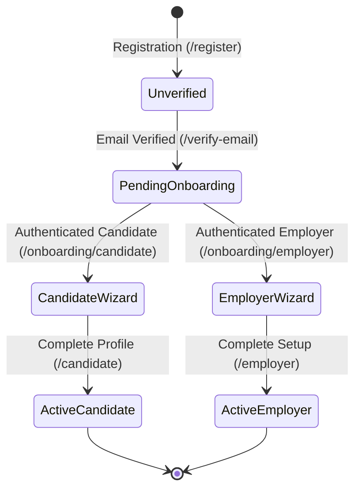
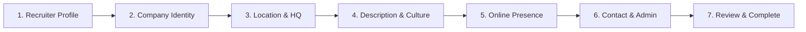

# KNOWTOHIRE — ONBOARDING WIZARDS & PROFILE INITIALIZATION SPECIFICATION
## Module 01: Task 04 — Candidate & Employer Onboarding Experiences

---

## 1. Executive Summary

Task 04 delivers the complete, production-quality onboarding wizards for **Candidate** and **Employer** accounts on KnowToHire. Built directly on the Supabase PostgreSQL authentication foundation from Task 01 and the route protection architecture from Task 02, these wizards guide verified users through structured profile initialization, progressive draft persistence, deterministic profile completeness scoring, and seamless transition from `pending_onboarding` to `active` account status.

---

## 2. Product Journey & Account State Machine



### State Definitions:
1. **`unverified`**: Account registered, awaiting email link confirmation. Protected routes redirect to `/verify-email`.
2. **`pending_onboarding`**: Email confirmed. Protected candidate/employer portal routes redirect to the appropriate onboarding wizard (`/onboarding/candidate` or `/onboarding/employer`).
3. **`active`**: Onboarding wizard finalized, profile records persisted. Full portal access granted. Users cannot reopen the onboarding wizard.
4. **`suspended`**: Account blocked by platform compliance or governance review.

---

## 3. Candidate Onboarding Wizard (10 Steps)

Located at `/onboarding/candidate` ([CandidateOnboardingPage.tsx](file:///e:/Projects/KnowToHire/src/pages/onboarding/CandidateOnboardingPage.tsx)).

```mermaid
graph LR
    S1[1. Basic Info] --> S2[2. About & Domain]
    S2 --> S3[3. Key Skills]
    S3 --> S4[4. Experience]
    S4 --> S5[5. Education]
    S5 --> S6[6. Certifications]
    S6 --> S7[7. Career Preferences]
    S7 --> S8[8. Compensation]
    S8 --> S9[9. Resume Upload]
    S9 --> S10[10. Review & Complete]
```



### Step Inventory & Validation Rules:

| Step | Title | Fields Collected | Validation Rules |
| :--- | :--- | :--- | :--- |
| **01** | Basic Information | `fullName`, `headline`, `phone`, `location` | `fullName`: min 2 chars (Required).<br>`headline`: min 3 chars (Required).<br>`location`: non-empty (Required).<br>`phone`: Optional, validated format if entered. |
| **02** | About You | `domainSpecialization`, `customDomainSpecialization`, `bio` | `domainSpecialization`: Required from taxonomy.<br>`bio`: 50–1000 characters (Required). Character counter enforced. |
| **03** | Key Skills | `skills: string[]` | Min. 3 skills, Max. 20 skills. Deduplication (case-insensitive). Quick-add suggestion chips. |
| **04** | Work Experience | `totalExperience`, `currentJobTitle`, `currentCompany`, `experienceYears` | `totalExperience`: Required band.<br>If `Fresher`: Role and company optional.<br>If Experienced: Role and Company required. |
| **05** | Education | `highestQualification`, `institution`, `fieldOfStudy`, `graduationYear` | `highestQualification`: Required.<br>`institution`, `fieldOfStudy`, `graduationYear`: Required. |
| **06** | Certifications | `certifications: CertificationItem[]` | Optional. Supports adding/removing structured items (Name, Issuing Org, Year). Quick preset templates. |
| **07** | Career Preferences | `preferredJobTitles`, `preferredLocations`, `remotePreference`, `employmentType` | `preferredJobTitles`: Min. 1 (Required).<br>`preferredLocations`: Min. 1 (Required).<br>`remotePreference`, `employmentType`: Required. |
| **08** | Salary Expectations | `minSalaryINR`, `maxSalaryINR`, `isNegotiable` | Currency: INR (₹) default.<br>`minSalaryINR` > 0, `maxSalaryINR` >= `minSalaryINR`. Non-negative. |
| **09** | Resume Upload | `resumeUrl`, `resumeFileName`, `resumeFileSize` | File types: PDF, DOC, DOCX.<br>Max size: 10 MB. Supabase Storage boundary integration. |
| **10** | Review & Complete | Structured summary of all 9 steps | Interactive "Edit" controls for each section. Live calculated profile completeness score.<br>Final CTA: "Complete My Profile". |

---

## 4. Deterministic Candidate Profile Completion Score

Profile completeness is calculated deterministically across 8 core dimensions, totaling exactly 100%:

| Dimension | Weight | Criteria |
| :--- | :--- | :--- |
| **Basic Information** | 15% | Full Name, Headline, and Location completed |
| **About & Specialization** | 15% | Bio >= 50 characters and Domain Specialization selected |
| **Key Skills** | 15% | At least 3 skills added |
| **Work Experience** | 15% | Total Experience band selected + role details (or Fresher) |
| **Education** | 15% | Highest Qualification, Institute, and Field completed |
| **Certifications** | 5% | At least 1 certification item added |
| **Career Preferences** | 15% | Job titles, Locations, Remote mode, and Employment type set |
| **Resume Upload** | 5% | Resume document uploaded |
| **Total Score** | **100%** | Persisted to `candidate_profiles.profile_completion_pct` |

---

## 5. Employer Onboarding Wizard (7 Steps)

Located at `/onboarding/employer` ([EmployerOnboardingPage.tsx](file:///e:/Projects/KnowToHire/src/pages/onboarding/EmployerOnboardingPage.tsx)).



### Step Inventory & Validation Rules:

| Step | Title | Fields Collected | Validation Rules |
| :--- | :--- | :--- | :--- |
| **01** | Recruiter Profile | `fullName`, `jobTitle`, `workPhone` | `fullName`: min 2 chars (Required).<br>`jobTitle`: Required.<br>`workPhone`: Valid phone format (Required). |
| **02** | Company Identity | `companyName`, `legalName`, `websiteUrl`, `industry`, `companySize` | `companyName`, `legalName`: Required.<br>`websiteUrl`: Valid URL format (Required).<br>`industry`, `companySize`: Required selections. |
| **03** | Corporate Location | `headquartersLocation`, `city`, `state`, `country` | `headquartersLocation`, `city`, `state`: Required.<br>`country`: Default 'India'. Quick city presets. |
| **04** | Company Description | `description`, `mission`, `cultureBenefits` | `description`: 50–1000 characters (Required).<br>`mission`, `cultureBenefits`: Optional. |
| **05** | Online Presence | `websiteUrl`, `linkedinUrl` | `websiteUrl`: Validated URL (Required).<br>`linkedinUrl`: Optional, validated URL. |
| **06** | Contact & Admin | `workEmail`, `contactPhone`, `isCompanyAdmin` | `workEmail`: Authoritative login email (Read-only).<br>`contactPhone`: Required.<br>`isCompanyAdmin`: Authorization checkbox (Required). |
| **07** | Review & Complete | Summary of all 6 previous sections | Edit controls for all sections.<br>Final CTA: "Complete Employer Setup". |

---

## 6. Company Verification Boundary

> [!IMPORTANT]
> **Company Verification is Strictly Decoupled from Onboarding:**
> - Initial `company_profiles.verification_status` is ALWAYS set to `'unverified'`.
> - Completing the employer onboarding wizard transitions the **User Account Status** from `pending_onboarding` to `active`, allowing access to the ATS portal.
> - Official enterprise verification is handled separately via compliance workflows in subsequent modules.

---

## 7. Database Integration & Persistence Mapping

### Candidate Data Mapping:
1. **`public.profiles`**:
   - `full_name` ➔ `formData.fullName`
   - `phone` ➔ `formData.phone`
   - `status` ➔ `'active'` (on Step 10 final completion)
2. **`public.candidate_profiles`**:
   - `headline` ➔ `formData.headline`
   - `bio` ➔ `formData.bio`
   - `location` ➔ `formData.location`
   - `domain_specialization` ➔ `formData.domainSpecialization`
   - `skills` ➔ `formData.skills` (`TEXT[]`)
   - `experience` ➔ Structured `JSONB` array
   - `education` ➔ Structured `JSONB` array
   - `certifications` ➔ `formData.certifications` formatted strings (`TEXT[]`)
   - `career_preferences` ➔ Structured `JSONB` object
   - `preferred_salary_min` ➔ `formData.minSalaryINR` (`NUMERIC`)
   - `preferred_salary_max` ➔ `formData.maxSalaryINR` (`NUMERIC`)
   - `employment_preference` ➔ `formData.remotePreference`
   - `resume_url` ➔ `formData.resumeUrl`
   - `profile_completion_pct` ➔ Computed deterministic percentage (`INTEGER`)

### Employer Data Mapping:
1. **`public.profiles`**:
   - `full_name` ➔ `formData.fullName`
   - `phone` ➔ `formData.workPhone`
   - `status` ➔ `'active'` (on Step 7 final completion)
2. **`public.company_profiles`**:
   - `name` ➔ `formData.companyName`
   - `legal_name` ➔ `formData.legalName`
   - `website_url` ➔ `formData.websiteUrl`
   - `industry` ➔ `formData.industry`
   - `company_size` ➔ `formData.companySize`
   - `headquarters_location` ➔ `formData.headquartersLocation`
   - `description` ➔ `formData.description`
   - `verification_status` ➔ `'unverified'`
3. **`public.employer_profiles`**:
   - `profile_id` ➔ Authenticated `user.id`
   - `company_id` ➔ Created/Linked `company_profiles.id`
   - `job_title` ➔ `formData.jobTitle`
   - `work_phone` ➔ `formData.workPhone`
   - `is_company_admin` ➔ `true`

---

## 8. Resume Storage Architecture

Resume handling is managed via `src/services/resumeService.ts`:
- **Validation**: Strict file format checks (`PDF`, `DOC`, `DOCX`) and file size limits (<= 10MB).
- **Supabase Storage Bucket**: Target bucket `'resumes'`.
- **Object Path**: `resumes/${userId}/${Date.now()}_${sanitizedFileName}`.
- **Storage Configuration Setup**:
  ```sql
  -- Run in Supabase SQL editor to create the resumes storage bucket:
  INSERT INTO storage.buckets (id, name, public) 
  VALUES ('resumes', 'resumes', true)
  ON CONFLICT (id) DO NOTHING;

  CREATE POLICY "resumes_upload_own"
    ON storage.objects FOR INSERT
    TO authenticated
    WITH CHECK (bucket_id = 'resumes' AND (storage.foldername(name))[1] = auth.uid()::text);

  CREATE POLICY "resumes_read_authenticated"
    ON storage.objects FOR SELECT
    TO authenticated
    USING (bucket_id = 'resumes');
  ```
- **Offline / Development Boundary**: If Supabase environment variables are unconfigured, `resumeService` provides clean local object references without faking storage claims or leaking service role credentials.

---

## 9. Security & Access Control

1. **Client & Server Identity Authority**: User IDs are never accepted from query parameters or hidden form fields; all operations use `supabase.auth.getUser()` or the authoritative `AuthContext.user.id`.
2. **Role Immutability**: Onboarding cannot alter user roles. Candidate cannot become Employer, and Employer cannot become Candidate.
3. **Admin Self-Escalation Block**: Handled at both UI level and PostgreSQL trigger level (`handle_new_user`).
4. **Row Level Security (RLS)**: Users can only modify their own profile, their candidate record, or their employer membership record.
5. **No Password/Token Persistence**: Component draft state lives in local React memory and is never written to `localStorage`.

---

## 10. Responsive & Accessibility Implementation

- **Responsive Viewports**: Tested across Mobile (375px, 430px), Tablet (768px, 1024px), and Desktop (1280px, 1440px).
- **Accessibility (WCAG 2.2 AA)**:
  - Explicit `<label htmlFor="...">` and `<input id="...">` bindings on all form inputs.
  - Visible focus indicators with 2px indigo focus ring.
  - Accessible button touch targets (min. 44px).
  - Keyboard navigation support across all step wizards and tag removal actions.
  - Informative, non-color-only validation messaging.
