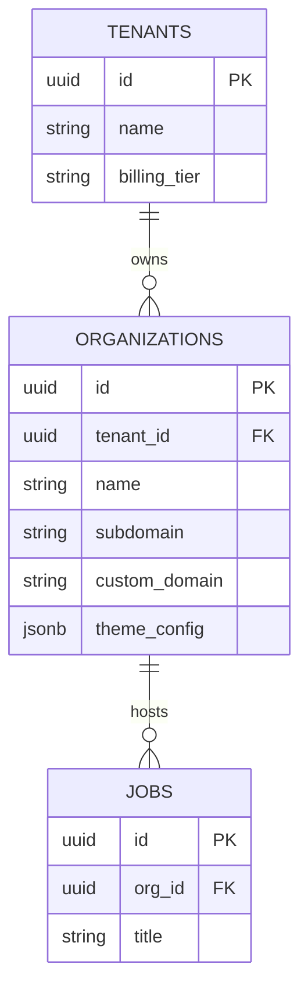

# Phase 2 Architecture Review: Enterprise Multi-Tenancy

This report details the architectural design and structural schema definitions required to implement a secure, scalable, and isolated **Enterprise Multi-Tenancy** runtime model for the **KnowToHire** platform.

---

## 🏢 1. Tenant Entity Model Trade-Offs

To support multi-brand corporations, universities, and recruitment agencies, we evaluate three organizational models:

| Model | Architecture | Trade-offs | Recommendation |
| :--- | :--- | :--- | :--- |
| **Flat Company Model** | Every user belongs to one `company_id`. | Simple, but cannot support recruitment agencies managing multiple sub-workspaces or parent corporations. | Rejected for Enterprise scale. |
| **Multi-Schema Separation** | Dedicated PG schemas per tenant. | Absolute data isolation, but complex migrations and high connection overhead. | Rejected for Cloud portability. |
| **Unified Tenant-Org-Workspace** | `Tenant` (billing boundary) -> `Organization` (brand) -> `Workspace` (team limits). | Supports hierarchies, white-labeling, and isolated teams under a single database schema. | **Selected & Recommended** |

### Preferred Hierarchy
```
Platform Admin
  └── Tenant (e.g. Acme Recruitment Corp) [Billing boundary]
        └── Organization (e.g. Acme UK, Acme US) [Branding & Theme boundary]
              └── Workspace (e.g. Engineering, Sales) [Data isolation & RLS boundary]
```

---

## 🗃️ 2. Database Schema & RLS Strategy

To migrate existing tables without data loss, we introduce a single `tenant_id` foreign key referencing the billing tenant, and an `org_id` referencing the branding context.



### Zero-Downtime Migration Strategy
1. **Add Optional Keys:** Add `tenant_id` and `org_id` nullable columns to `public.companies`, `public.jobs`, `public.applications`.
2. **Backfill Script:** Run a script linking existing companies to default tenant rows matching their current company IDs.
3. **Set Constraints:** Set the columns as `NOT NULL` and enable RLS policies matching the target roles.

---

## 🔒 3. Row-Level Security (RLS) Policies
Data access is restricted by database-level security policies checking the user's mapped workspace permissions rather than relying on frontend code:

```sql
CREATE POLICY tenant_isolation ON public.jobs
  FOR ALL
  USING (
    org_id = (
      SELECT company_id 
      FROM public.company_team_members 
      WHERE employer_id = auth.uid()
    )
  );
```

---

## 🌐 4. Domain & Theme Resolution
- **Subdomain Resolver:** Parses subdomains dynamically (e.g., `acme.knowtohire.com`). Matches `company.subdomain`.
- **CNAME Custom Domain Resolver:** Resolves custom domains (e.g., `careers.acme.com`). Matches `company.custom_domain`.
- **Dynamic CSS Variable Injection:** Evaluates selected themes and binds variables to `:root`:
  ```css
  :root {
    --primary-color: var(--tenant-primary, #0F52BA);
    --font-heading: var(--tenant-font, 'Outfit');
  }
  ```

---

## 📋 5. Operational Risk Assessment
- **Cross-Tenant Leaks:** Mitigation is achieved by writing strict automated schema validation unit tests before promoting migrations.
- **Performance Degradation:** Multi-tenant queries utilize index paths:
  ```sql
  CREATE INDEX idx_jobs_tenant ON public.jobs(org_id);
  ```
