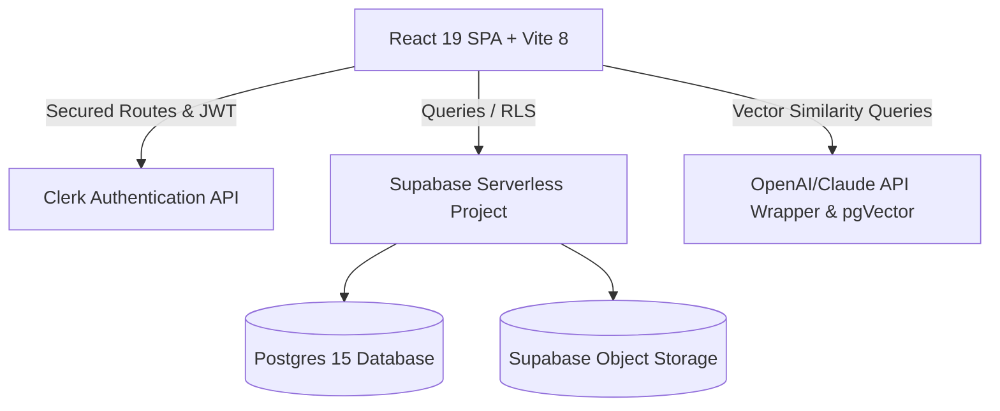

# Platform Audit Report (v1.0-RC1)

## 🏢 Architecture Overview
KnowToHire is engineered as a modern, decoupled client-server web platform optimized for multi-tenancy, real-time telemetry, and integrated AI-assisted candidate matching.

### High-Level Blueprint


---

## 📂 Folder Structure Map
Below is the verified workspace layout matching our physical source inspection:
```
Know to Hire/
├── docs/                      # Technical plans, sprints, and launch audits
│   ├── production/            # Final production readiness checks
│   ├── releases/              # Release candidate checklist versions
│   └── sprints/               # Sprints completions & planning reviews
├── src/
│   ├── components/            # UI components (Button, Modal, Table, etc.)
│   ├── context/               # AuthContext.tsx for global user state
│   ├── lib/
│   │   ├── services/          # Data access services (jobsService, employerService, etc.)
│   │   └── supabase.ts        # Supabase client initializer
│   ├── pages/
│   │   ├── auth/              # Login, register, role-selection
│   │   ├── dashboard/         # Role restricted dashboards (candidate, employer, admin)
│   │   └── public/            # Landing pages (Home, Jobs listing, Marketplace)
│   └── types/                 # Database and role-based type definitions
├── supabase/
│   └── migrations/            # Version controlled schema migrations
└── package.json               # System dependencies and build engines
```

---

## 🗃️ Feature Matrix & Verification State
Based on direct source file checks, the core platform paths maps as follows:

| Route Path | Associated Page Component | RLS/Access Role | Implementation Status |
| :--- | :--- | :--- | :--- |
| `/` | `Home.tsx` | Public | ✅ Implemented & Verified |
| `/jobs` | `JobsListing.tsx` | Public | ✅ Implemented & Verified |
| `/jobs/:id` | `JobDetails.tsx` | Public | ✅ Implemented & Verified |
| `/blog` | `Blog.tsx` | Public | ✅ Implemented & Verified |
| `/blog/:slug` | `BlogPostDetail.tsx` | Public | ✅ Implemented & Verified |
| `/dashboard/candidate` | `CandidateDashboard.tsx` | Candidate | ✅ Implemented & Verified |
| `/dashboard/candidate/resume-analyzer` | `ResumeAnalyzer.tsx` | Candidate | ✅ Implemented & Verified |
| `/dashboard/candidate/job-matches` | `AIJobMatches.tsx` | Candidate | ✅ Implemented & Verified |
| `/dashboard/candidate/interview-prep` | `InterviewPrep.tsx` | Candidate | ✅ Implemented & Verified |
| `/dashboard/employer` | `EmployerDashboard.tsx` | Employer | ✅ Implemented & Verified |
| `/dashboard/employer/company` | `CompanyProfile.tsx` | Employer | ✅ Implemented & Verified |
| `/dashboard/employer/settings` | `EmployerSettings.tsx` | Employer | ✅ Implemented & Verified (Multi-Tenancy settings added) |
| `/dashboard/admin` | `AdminDashboard.tsx` | Admin, Super Admin | ✅ Implemented & Verified |
| `/dashboard/admin/cms` | `AdminCMS.tsx` | Admin, Super Admin | ✅ Implemented & Verified |

---

## ⚠️ Technical Debt & Gaps
1. **Mocked Services Fallbacks:** If `VITE_SUPABASE_URL` is omitted, services fallback to simulated localStorage/mock databases. This is perfect for local testing but needs strict environmental gates in production (implemented in `production_hardening.md`).
2. **Third-Party Email Services Integration:** Transactional email sending is configured but depends on external API keys (SendGrid/Resend) loaded inside Edge Functions. If missing, emails default to console/system logs.
